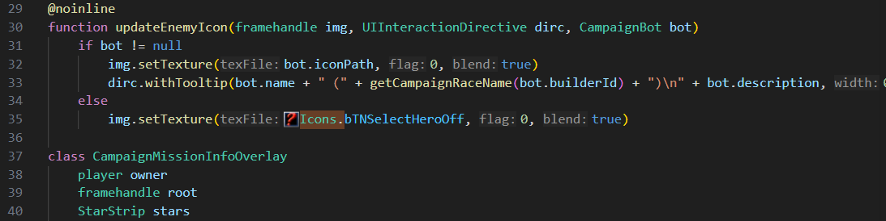
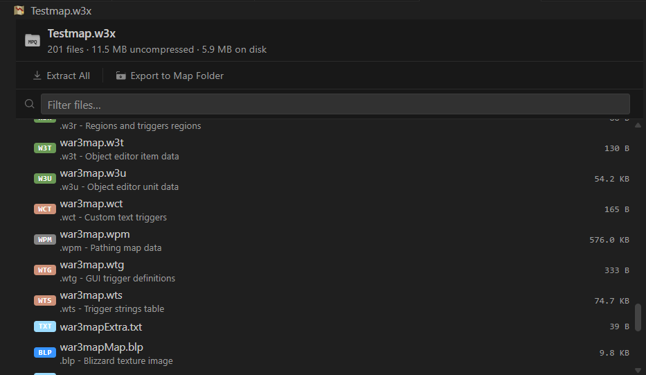
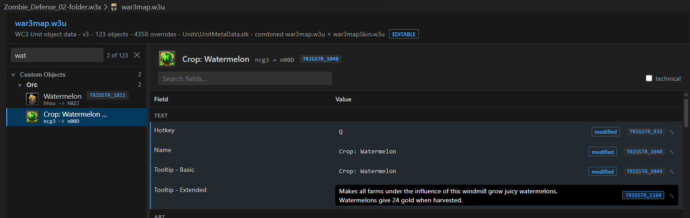
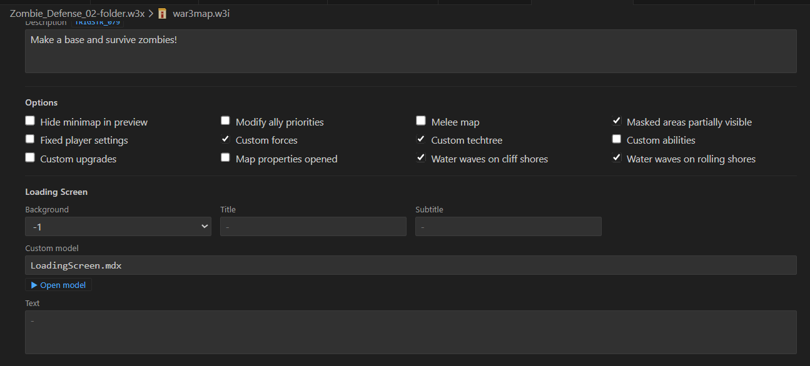
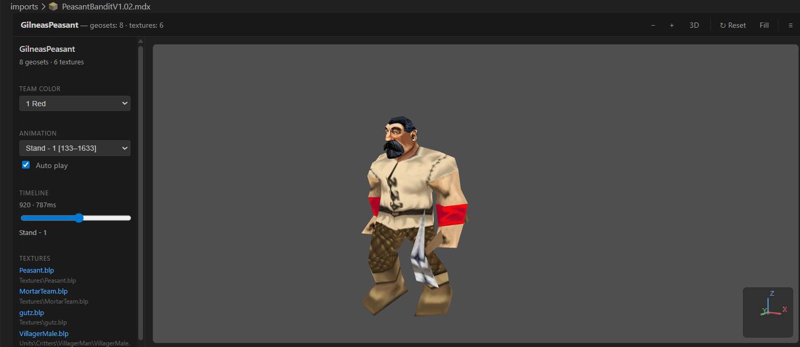

# WurstScript for Visual Studio Code

Modern Wurst and Jass development for Warcraft III. Write typed WurstScript, compile to Jass or Lua, and build, test, inspect, and run maps without leaving VS Code.



## One extension, complete setup

The extension installs and updates the Wurst compiler, bundled Java runtime, and Grill CLI automatically. No separate Java or compiler setup is needed.

1. Open an existing project folder containing `wurst.build`, or run **Wurst: New Wurst Project**.
2. Accept the installation prompt.
3. Open a `.wurst` file and use the play button to build and run your map.

Installation and updates are managed under `~/.wurst`. Updates are coordinated across VS Code windows, reuse prepared downloads when retrying, and detect Wurst processes that are locking installation files.

Supported on Windows, macOS, and Linux, with x64 and Arm64 builds where available. NixOS and custom environments can provide Java through `wurst.javaExecutable`.

## Language intelligence

- Context-aware completion with types, parameters, and documentation
- Integrated JassDoc for Warcraft III natives and their Wurst wrappers
- Live diagnostics, inlay hints, signature help, hovers, and quick fixes
- Go to definition, find references, symbol rename, breadcrumbs, and Outline view
- File and workspace symbol search
- Syntax highlighting for Wurst, Jurst/Jass, WTS, FDF, TOC, and MDL
- `@compiletime` gutter markers and workspace-wide quick-fix support
- Clickable asset paths, CodeLens actions, hover previews, and inline icons in source files

WurstScript itself provides packages, classes, closures, extension methods, compile-time code, unit testing, dependency management, and a large WC3-focused standard library. The same source can target Jass or Lua.

## Warcraft III inside VS Code

Opening a supported Warcraft III file selects a dedicated viewer or editor:

| Area | Formats and actions |
| --- | --- |
| Map archives | Browse `.w3x`/`.w3m` MPQ contents, open entries, extract files, or export a folder-mode map |
| Object data | Inspect and edit `.w3u`, `.w3t`, `.w3a`, `.w3b`, `.w3d`, `.w3h`, and `.w3q` |
| Map information | Safely edit supported `.w3i` fields while preserving untouched binary data |
| Map structures | Inspect `.doo`, `.wpm`, `.wtg`, and `.wct` files |
| Other map data | Preview `.mmp`, `.shd`, `.w3c`, `.w3r`, `.w3e`, `.w3s`, `.w3l`, `.w3o`, and `.imp` |
| Images and models | Preview `.blp`, `.dds`, `.tga`, `.mdx`, and `.mdl` with 3D animation and team-color controls |
| Audio | Play `.mp3`, `.wav`, `.ogg`, and `.flac` assets |

Packed `.w3x`/`.w3m` maps and Reforged folder-mode maps can both be selected, built, and run. The MPQ viewer can export an existing archive as a version-control-friendly map folder.



Object-data editors resolve rawcodes, game metadata, icons, base values, and trigger strings while keeping custom overrides editable.



The `.w3i` editor exposes supported map-information fields while preserving the remainder of the binary file unchanged.



The experimental **Wurst: Preview Map Terrain** command renders terrain, cliffs, water, doodads, units, and start locations from an exploded map.

## CASC-backed assets

The extension reads stock Warcraft III data directly from the installed game's CASC storage. Asset browsers and previews can resolve:

- World Editor names, metadata, rawcodes, and localized `WESTRING` labels
- Unit, item, ability, destructable, doodad, buff, and upgrade icons
- Reforged skin data, models, textures, and terrain art
- Project assets across map folders, imports, the workspace, caches, and game data

This powers searchable object catalogs, inline command-button icons, texture hovers, and models with their dependent textures.



## Build, test, and run

Search for **Wurst** in the Command Palette to:

- Create, install, update, or repair a Wurst project
- Build and run `.w3x`/`.w3m` maps or map folders
- Run all tests, the current file's tests, or the test under the cursor
- Start and update maps with Jass Hot Code Reload
- Configure the Warcraft III executable and launch arguments
- Inspect logs or stop stale Wurst language-server processes

## Configuration

Most projects need no custom settings. Common overrides are `wurst.wc3path`, `wurst.gameExePath`, `wurst.wc3RunArgs`, `wurst.mapDocumentPath`, `wurst.javaExecutable`, and the Jass Hot Code Reload settings. Search for **Wurst** in VS Code Settings for the complete list.

## Learn WurstScript

- [Installation and quick start](https://wurstlang.org/start.html)
- [Beginner guide](https://wurstlang.org/wurstbeginner.html)
- [Language manual](https://wurstlang.org/manual.html)
- [Documentation and tutorials](https://wurstlang.org/documentation)
- [WurstScript on GitHub](https://github.com/wurstscript/WurstScript)
- [Community Discord](https://discord.gg/mSHZpWcadz)

Report extension problems in the [wurst4vscode issue tracker](https://github.com/wurstscript/wurst4vscode/issues).

## Extension development

Install a current Node.js LTS release, clone the repository, and run `npm install`. Open it in VS Code and press `F5` to launch an Extension Development Host.

Before submitting a change:

```sh
npm test
npx tsc -p . --noEmit
npm run vscode:prepublish
```
